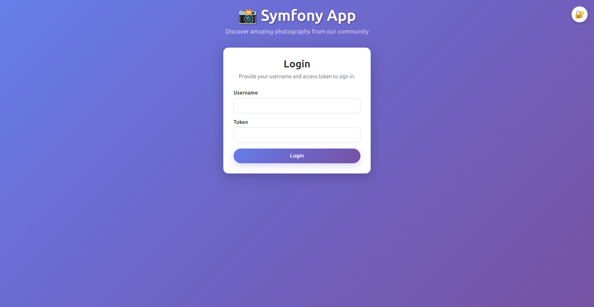
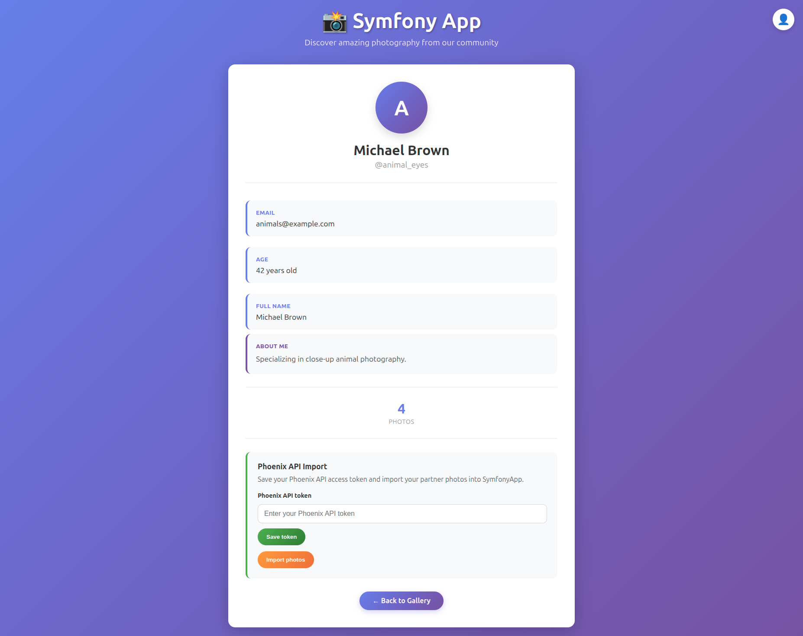

| Aplikacja | CI | Coverage |
|---|---|---|
| Symfony | [](https://github.com/karpdamian-ctrl/rekrutacja/actions/workflows/symfony-ci.yml) | [](https://codecov.io/gh/karpdamian-ctrl/rekrutacja) |
| Phoenix | [](https://github.com/karpdamian-ctrl/rekrutacja/actions/workflows/phoenix-ci.yml) | [](https://codecov.io/gh/karpdamian-ctrl/rekrutacja) |

## Zrealizowane Zadania

- ✅ **Zadanie 1:** Poprawiłem jakość SymfonyApp poprzez naprawę błędów bezpieczeństwa i logiki, refaktor struktury oraz rozszerzenie pokrycia testami.
- ✅ **Zadanie 2:** Dodałem obsługę tokenu Phoenix API w profilu użytkownika oraz ręczny import zdjęć do SymfonyApp.
- ✅ **Zadanie 3:** Dodałem filtrowanie galerii po `location`, `camera`, `description`, zakresie dat opartym o `taken_at` oraz `username`.
- ✅ **Zadanie 4:** Zaimplementowałem rate limiting w Phoenix API z użyciem OTP oraz obsłużyłem błędy limitów importu po stronie SymfonyApp.

Szczegółowe notatki implementacyjne, decyzje architektoniczne i dziennik pracy znajdują się w [docs/NOTES.md](docs/NOTES.md).

## Zrzuty Ekranu

### Strona główna

<a href="docs/images/homepage.png">
  
</a>

### Logowanie

<a href="docs/images/login.png">
  
</a>

### Profil użytkownika

<a href="docs/images/profil.png">
  
</a>

## Najważniejsze Usprawnienia

- Naprawiłem krytyczne problemy związane z uwierzytelnianiem i bezpieczeństwem w SymfonyApp, w tym poprawne powiązanie tokenu z użytkownikiem oraz ochronę CSRF.
- Zastąpiłem wcześniejszy toggle lajków jawnymi akcjami `like` i `unlike`, dzięki czemu zachowanie aplikacji jest czytelniejsze i bezpieczniejsze przy dalszym rozwoju.
- Dodałem ograniczenia unikalności na poziomie bazy oraz zabezpieczenia po stronie aplikacji dla lajków i importowanych zdjęć, żeby lepiej chronić integralność danych.
- Przeniosłem logikę kontrolerów do serwisów i wspólnych abstrakcji, żeby projekt był łatwiejszy w utrzymaniu i rozbudowie.
- Dodałem warstwowe testy automatyczne obejmujące scenariusze jednostkowe, funkcjonalne i integracyjne.
- Usprawniłem integrację Symfony z Phoenix, jawnie wskazując w requestach tylko te pola zdjęć, które są rzeczywiście potrzebne.
- Dodałem filtrowanie, walidację importu oraz obsługę limitów z komunikatami przyjaznymi dla użytkownika.
- Zaimplementowałem rate limiting importu w Phoenix z użyciem OTP oraz rozróżniłem obsługę limitu użytkownika i limitu globalnego po obu stronach integracji.

## Jakość Projektu

- Pipeline'y GitHub Actions dla Symfony i Phoenix
- Statyczna analiza i sprawdzanie stylu kodu
- Testy jednostkowe, funkcjonalne i integracyjne
- Raportowanie pokrycia testami w badge'ach README

## Jak Sprawdzać Projekt

1. Uruchom środowisko komendą `docker-compose up -d`.
2. Wykonaj migracje i seedowanie obu aplikacji.
3. Uruchom checki jakości z sekcji `Quality` poniżej.
4. Przejrzyj notatki implementacyjne w [docs/NOTES.md](docs/NOTES.md).

## Świadome Kompromisy

- Pozostałem przy filtrowaniu zdjęć w SQL zamiast dodawania Elasticsearcha, ponieważ przy tej skali zadania search engine byłby zbędnym skomplikowaniem rozwiązania.
- Rate limiting w Phoenix jest oparty o pamięciowy proces OTP `GenServer`, co dobrze pasuje do zakresu zadania, ale przy wielu instancjach aplikacji wymagałoby współdzielonego storage.
- Testy integracyjne z Phoenix są uruchamiane świadomie, dzięki czemu podstawowa paczka testów pozostaje szybka i niezależna od żyjącej zewnętrznej usługi.

## Architektura

Ten projekt składa się z dwóch oddzielnych aplikacji z własnymi bazami danych:

- **Symfony App** (port 8000): Główna aplikacja internetowa
  - Baza danych: `symfony-db` (PostgreSQL, port 5432)
  - Nazwa bazy danych: `symfony_app`

- **Phoenix API** (port 4000): Mikroserwis REST API
  - Baza danych: `phoenix-db` (PostgreSQL, port 5433)
  - Nazwa bazy danych: `phoenix_api`

## Szybki start
```bash
# Linux: uruchamiaj kontenery jako aktualny użytkownik hosta
LOCAL_UID=$(id -u) LOCAL_GID=$(id -g) docker compose up -d --build --force-recreate

docker-compose up -d

# Konfiguracja bazy danych Symfony
docker-compose exec symfony php bin/console doctrine:migrations:migrate --no-interaction
docker-compose exec symfony php bin/console app:seed

# Konfiguracja bazy danych Phoenix
docker-compose exec phoenix mix ecto.migrate
docker-compose exec phoenix mix run priv/repo/seeds.exs
```

Sprawdzenie użytkownika w kontenerach:
```bash
LOCAL_UID=$(id -u) LOCAL_GID=$(id -g) docker compose exec phoenix id
LOCAL_UID=$(id -u) LOCAL_GID=$(id -g) docker compose exec symfony id
```

Dostęp do aplikacji:
- Symfony App: http://localhost:8000
- Phoenix API: http://localhost:4000

## Komendy Symfony

### Migracja bazy danych
```bash
docker-compose exec symfony php bin/console doctrine:migrations:migrate --no-interaction
```

### Ponowne tworzenie bazy danych
```bash
docker-compose exec symfony php bin/console doctrine:schema:drop --force --full-database
docker-compose exec symfony php bin/console doctrine:migrations:migrate --no-interaction
docker-compose exec symfony php bin/console app:seed
```

### Czyszczenie pamięci podręcznej (Cache)
```bash
docker-compose exec symfony php bin/console cache:clear
```

### Restart
```bash
docker-compose restart symfony
```

### Uruchamianie testów
```bash
docker-compose exec symfony php bin/phpunit
```

## Komendy Phoenix

### Migracja bazy danych
```bash
docker-compose exec phoenix mix ecto.migrate
```

### Seedowanie bazy danych
```bash
docker-compose exec phoenix mix run priv/repo/seeds.exs
```

### Ponowne tworzenie bazy danych
```bash
docker-compose exec phoenix mix ecto.reset
docker-compose exec phoenix mix run priv/repo/seeds.exs
```

### Restart
```bash
docker-compose restart phoenix
```

### Uruchamianie testów
```bash
docker-compose exec phoenix mix test
```

## Quality

### Symfony
```bash
docker-compose exec symfony composer test
docker-compose exec symfony composer phpstan
docker-compose exec symfony composer php-cs-fixer
```

### Symfony integration test
Wymaga działającego i zseedowanego Phoenix API.

```bash
docker-compose exec phoenix mix ecto.migrate
docker-compose exec phoenix mix run priv/repo/seeds.exs
docker-compose exec symfony composer test-integration
```

### Phoenix
```bash
docker-compose exec phoenix mix test
docker-compose exec phoenix mix format --check-formatted
docker-compose exec phoenix mix credo
```
